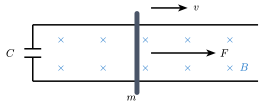

## 典

經典的有電容有外力單杆：

PS：圖是 Gemini 畫的，直接輸出 Typst 代碼。感覺加訓 pelican riding a bicycle 有效果。

很容易列出幾個方程：

$$
\begin{gather*}
Ft - ILBt = mv - 0 \\
It = q \\
E = vBL \\
C = \frac{q}{U} \\
I = \frac{E - U}{R} \\
\end{gather*}
$$

我去，這怎麼做。

還好，高中只會考 $R = 0$ 的情況。由於電阻是 $0$，所以能**瞬間**達到穩態。于是可以認爲 $E = U$。

但是 $I = \frac{E - U}{R}$ 是什麼？這下子成 $0/0$ 未定式了。先不管它。

那：

$$
It = q = CU = CvBL
$$

于是：

$$
\begin{gather*}
Ft - CvB^2L^2 = mv \\
v = \frac{Ft}{m + CB^2L^2} \\
\end{gather*}
$$

好吧，求出速度了。然後其它的都可以求了，比如 $I = \dot{q} = CaBL = \frac{FCBL}{m + CB^2L^2}$。

## 幹

可是某同學不太能理解電阻爲 $0$，憑什麼就瞬間穩態，所以他想出來可以先求解電阻 $R$ 不爲 $0$ 的情況，再分析 $R \to 0$ 的極限。

先消元，把 $v$ 用 $q$ 表示：

$$
\begin{align*}
I = \dot q &= \frac{vBL - \frac{q}{C}}{R} \\
v &= \frac{\dot q R + \frac{q}{C}}{BL} \\
\end{align*}
$$

帶回動量守恆：

$$
\begin{align*}
Ft - qLB &= mv \\
Ft - qLB &= m \frac{\dot q R + \frac{q}{C}}{BL} \\
\frac{mR}{LB} \dot q + \left( \frac{m}{LBC} + LB \right)q - Ft = 0 \\
\end{align*}
$$

只用把 $q$ 解出來就行了。

## 解

姜萍會偏微分方程，而這是一個簡單的一階常係數不齊次微分方程。

爲了讓式子不要太亂，我們其實就相當於解：

$$
A \dot q + B q = F t
$$

某同學于是找物理競賽同學借了一本《高等數學》，仔細研讀了一節晚自習。

衆所周知，解不齊次微分方程只需要用一個**特解**疊加上齊次方程的**通解**。

先來看通解，這個在 [導][high-school-calculus] 中有介紹。即先把 $Ft$ 當成 $0$：

[high-school-calculus]: /posts/high-school-calculus#微分方程

$$
A \dot q + B q = 0
$$

解得 $q_h(t) = C_0\e^{-\frac{B}{A}t}$

然後只需要找一個特解，我們使用待定係數法，因爲 $Ft$ 關於 $t$ 是一次的，所以應該假設 $q_p(t) = b_0 t + b_1$。帶入：

$$
\begin{align*}
A b_0 + B (b_0 t + b_1) &= F t \\
(B b_0 - F) t + A b_0 + B b_1 &= 0 \\
\end{align*}
$$

故解得：

$$
\begin{cases}
b_0 = \frac{F}{B} \\
b_1 = -\frac{AF}{B^2} \\
\end{cases}
$$

即特解：$q_p(t) = \frac{F}{B} t - \frac{AF}{B^2}$。

然後疊加。

$$
\begin{align*}
q(t) &= q_p(t) + q_h(t) \\
     &= \frac{F}{B}t - \frac{AF}{B^2} + C_0 \e^{-\frac{B}{A}t}\\
\end{align*}
$$

要滿足初始條件 $q(0) = 0$：

$$
q(0) = - \frac{AF}{B^2} + C_0 = 0
$$

故 $C_0 = \frac{AF}{B^2}$。

最後帶回來，這裏 $A = \frac{mR}{LB}, B = \frac{m}{LBC} + LB$：

$$
q = \frac{F}{\frac{m}{LBC} + LB} t + \frac{\frac{mR}{LB} F}{\left( \frac{m}{LBC} + LB \right)^2}\left( \e^{-\frac{\frac{m}{LBC} + LB}{\frac{mR}{LB}} t} - 1 \right)
$$

停停停。我們雖然是解出來了，但是這個有點太醜了。不過可以看出，當 $R=0$ 時，後面項就是 $0$，于是 $q = \frac{FLB}{m + L^2B^2C}t$ 很合理，也和上面推出來的吻合。

## 等

其實電容和杆子是有驚人的相似性的。

再看一眼動量守恆的式子：

$$
Ft - ILBt = mv - 0
$$

我們不妨把 $ILBt = qLB$ 當作電容的動量，這樣剛好動量守恆：$Ft = mv + qLB$。

既然這樣，不如假設電容有「等效質量」$M$ 和「等效速度」$u$，那麼：

$$
Mu = qLB
$$

爲了讓這個等效的質量速度有和諧美好的性質，$M$ 和 $u$ 可不能隨便亂取，最好還要滿足能量守恆：

$$
\frac12 Mu^2 = \frac12 CU^2 = \frac12 \frac{q^2}{C}
$$

于是解得：

$$
\begin{cases}
M = L^2B^2C \\
u = \frac{q}{LBC} \\
\end{cases}
$$

豁然開朗啊。這個 $M = L^2B^2C$ 似曾相識。

甚至當 $u = v$ 的時候，相當於：

$$
\begin{align*}
\frac{q}{LBC} &= v \\
\frac{q}{C} &= vBL \\
\end{align*}
$$

恰好是穩態條件。所以下次再遇到一個電容加一個帶初速度的杆子的時候，可以直接寫出最終穩態時杆子速度 $v = \frac{mv_0}{m + L^2B^2C}$。

## RC

考慮一個簡單的 RC 串聯電路。電容初始有 $q_0$ 的電荷量。可以列方程：

$$
\begin{gather*}
I = \frac{U}{R} \\
C = \frac{q}{U} \\
I = - \dot q \\
\end{gather*}
$$

於是：

$$
\dot q + \frac{1}{RC} q = 0
$$

然後很顯然可以看出。

$$
q = q_0 \e^{-\frac{1}{RC}t}
$$

令 $\tau = RC$，量綱分析這個 $\tau$ 就是一個時間。$\tau$ 很有意義，比如 $q(\tau) = \frac{1}{\e} q_0$，恰好是電荷量變成初始 $\frac{1}{\e}$ 的時候。

好吧，更大的意義是就可以把上面 $q$ 寫成：

$$
q = q_0 \e^{-\frac{t}{\tau}}
$$

由此可見，理論上 RC 串聯電路永遠不會達到穩態。

## 簡

我們現在可以來通過設一些比較有意義的常數把上面的 $q$ 化簡了。就按照上面的，令：

$$
\begin{gather*}
M = L^2B^2C \\
u = \frac{q}{LBC} \\
\end{gather*}
$$

那麼

$$
\begin{align*}
q &= \frac{F}{\frac{m}{LBC} + LB} t + \frac{\frac{mR}{LB} F}{\left( \frac{m}{LBC} + LB \right)^2}\left( \e^{-\frac{\frac{m}{LBC} + LB}{\frac{mR}{LB}} t} - 1 \right) \\
  &= \frac{FLBC}{m + M}t + \frac{mRLBC^2F}{(m+M)^2}(\e^{-\frac{m + M}{mRC}t} - 1) \\
\end{align*}
$$

不妨令 $\tau = \frac{mRC}{m + M}$：

$$
\begin{align*}
q &= \frac{LBCF}{m + M}t + \frac{LBCF\tau}{m+M}(\e^{-\frac{t}{\tau}} - 1) \\
  &= LBC\left( \frac{F}{m + M}t + \frac{F\tau}{m+M}(\e^{-\frac{t}{\tau}} - 1) \right) \\
\end{align*}
$$

那麼：

$$
\begin{align*}
u &= \frac{q}{LBC} \\
  &= \frac{F}{m + M} \left( t + \tau(\e^{-\frac{t}{\tau}} - 1) \right) \\
\end{align*}
$$

回過來求 $v$。別忘了，我們可以直接動量守恆：

$$
\begin{gather*}
mv + Mu = Ft \\
\begin{align*}
v &= \frac{Ft - Mu}{m} \\
  &= \frac{Ft - M\frac{F}{m + M} \left( t + \tau(\e^{-\frac{t}{\tau}} - 1) \right)}{m} \\
  &= \frac{F}{m + M}\left(t - \frac{M}{m}\tau\left(\e^{-\frac{t}{\tau}} - 1\right)\right) \\
\end{align*}
\end{gather*}
$$

好吧，其實挺美觀的，不是嗎。

那時間跟質量乘除有什麼直觀物理意義呢？不知道，也許讓式子美觀就是它的意義。
