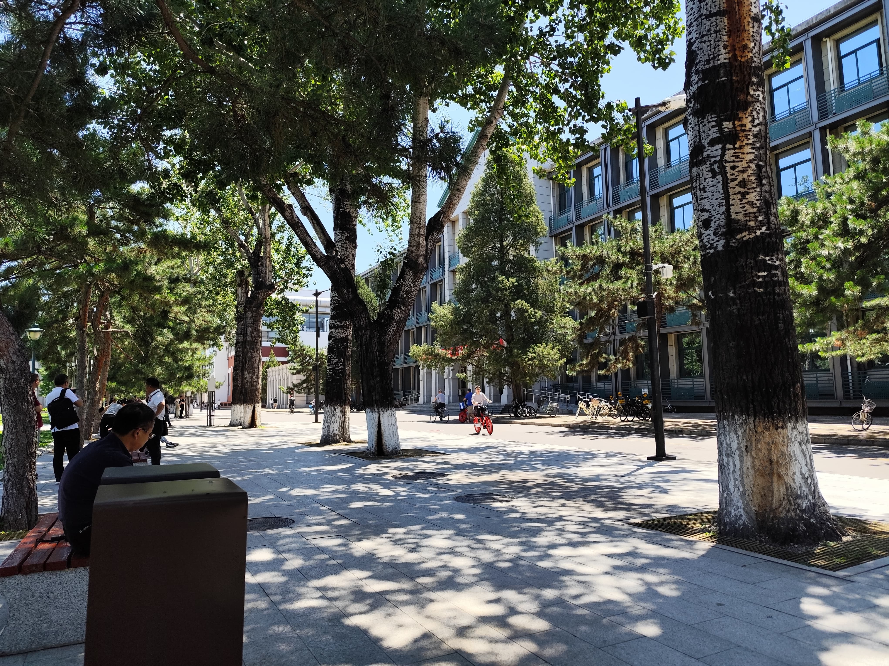
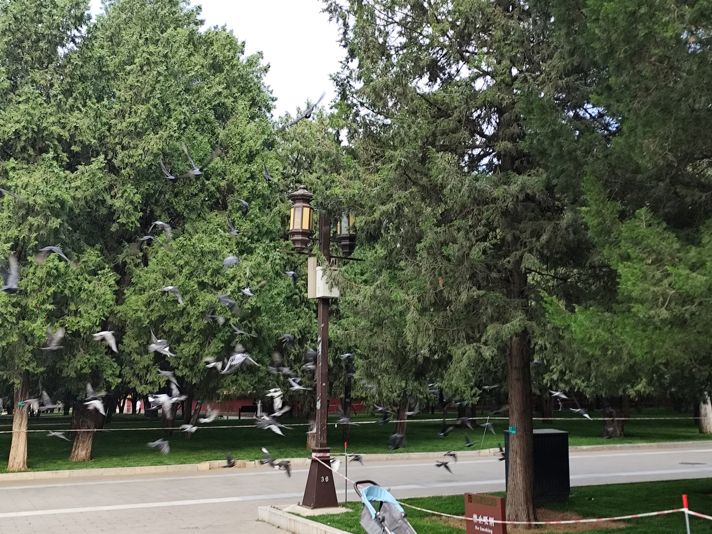

人大是中国人民大学，当然如果我能当全国人大代表也很好。

## 一

我居然过了人大强基初试。挺幸运的。感觉好多数学物理都不会，最后还是以高于分数线 15 分的成绩过了（满分 360）。

总之我要去北京了。

## 二

上次去北京，应该是小学五年级。当时大多数旅途经历已经模糊了，升旗、爬长城、北京烤鸭、参观清北，这就是标准北京旅游套餐。

看天安门升旗，那时正是八一建军节，早上四点钟不到就起床，到了广场，早已是人头攒动。其实也看不到什么，小学的我个子不高，人又太多，好像听到国歌声，尽力看看，国旗就已经到顶了。最深刻的反而是看到围栏内部，就在旗杆旁边，有小学生排成方队，能直接近距离看升旗。所以北京小学生的尊贵一下子就凸显出来了。

听说现在参观天安门需要预约了。偌大一个广场，居然得全部围栏封起，要安检，要预约，显得有点过分庄重了。

确实，天安门太厚重了，北京太厚重了。这是元明清三代的京城，现代的首都，这里集中了中国最高的政治权力。到处皇家色彩的红墙，还有灰色的胡同青砖，天有时蓝得透彻，有时晦暗昏沉。天安门更是把这种厚重具象化了。更何况，你知道，天安门广场上，有五四运动，一二·九运动，有开国大典，有阅兵……四十四万平方米的广场，从来都是挤满了人的，历史的人，现在的人。

北京风很大，没有树荫的地方太阳很晒，就是典型的北方气候。也许住惯了，我还是更喜欢成都，天府之国。但北京能下雪，不得不令我向往。

## 三

按照考生须知，考生不得透露任何关于初试的相关内容，但复试好像没有这个规定。

排队的时候遇到了个四川文科考生，开玩笑问我物理能不能有他历史高。然后进候考区，先是看到一个拿着《算法竞赛高端指南》的考生，应该是 OIer，于是坐到他旁边套近乎。然后发现旁边又有两个四川 OIer，嘉祥的，应该在省选还是 WC 见过。这次人大强基 OIer 好像有点多。

听他们说，去年考题有“证明任意一个竞赛图都有哈密顿通路”，这可把我吓到了。我早都不记得哈密顿通路是什么意思了，他们也不知道，于是只能相信今年题目不可能和去年重了。

然后莫名其妙又聊到排序，突然就聊到了有没有优于 $O(n\log n)$ 基于比较的排序。我很自豪地给我旁边那个拿蓝书的同学讲解，如何用**信息论**分析基于比较排序的复杂度下界：

> 每次比较，可得到小于和不小于两种结果。进行 $m$ 次比较操作，总共就能得到 $2^m$ 种比较结果。而长度为 $n$ 的排列共有 $n!$ 种。
>
> 所以要通过比较把不同排列区分出来并得到正确的排序方式， $2^m \ge n!$，所以 $m = O(\log(n!))$，根据斯特林近似，那 $m = O(n\log n)$。

面试抽签，我们这一坨抽到了连续的前四个号。只有一个同学号比较靠后，他既没带水又没带书，挺煎熬。

到我面试了，有点紧张。

先是第一个房间。一道数学和一道信息题。果断选择信息。

> 一个有向图，可以选一条边让他的权重 $w = f(w)$，问 $s$ 到 $t$ 的最短路。
>
> 1. $f(x) = \lfloor x / 2\rfloor$
> 2. $f(x) = x - C$（$f(x)$ 可能小于 $0$）

第一问我说建分层图，然后 Dijkstra 跑最短路。

而后第二问，我糊涂了。我知道 Dijkstra 不能处理负权图，但我忘了该用什么算法了，于是我说，用 Johnson 算法。这当然是错的，Johnson 是先在 Bellman-Ford 跑了一次单源最短路之后，跑全源最短路用的。而且我已经不记得 Johnson 和 Bellman-Ford 具体怎么做了。

沉默一下后，我又说，对于任意一条最短路，这个 f(x) 的贡献是一样的，所以直接跑单源最短路再在答案上减 C 就行了。这当然也是错的，我完全忘记了要考虑负环。

后来教授又问我，问一能不能不建分层图，我说可以 Dijkstra 的同时维护每个节点最短路径最大边权，然后在最大边权上除以二。这个应该是对的。

然后第二个房间。一道数学，一道题干有点长的物理，和一道信息。

> `randN()` 是一个生成 `[1, N]` 的均匀随机整数的函数。可以调用 `rand5()`，要生成 `rand7()`。
>
> 1. 怎么做？
> 2. 这个做法，调用 $n$ 次期望会用几次 `rand5()`？如果 $n$ 足够大，最少需要几次 `rand5()`？

我从第一问开始蠢。先 `rand5()` 对 5 拒绝采样，得到 `rand4()`，两个 `rand4()` 拼起来，去掉一位，得到 `rand8()`，再对 8 拒绝采样，得到 `rand7()`。需要调用次数： $\left( \frac{5}{4} \times 2 \right) \times \frac{8}{7} = \frac{20}{7}$。

然后对于 $n$ 足够大，教授质问我有没有懂这是什么意思？我很含糊地说，两个 `rand4()` 拼起来的时候，可以把去掉的一位留给下一次使用。我确实没体会到 $n$ 足够大的含义。

然后出考场，我悟了。用**信息论**分析，`rand5()` 提供 $\log 5$ 的熵，生成 `rand7()` 需要$\log 7$ 的熵，所以 $n$ 足够大的时候理论下界是 $\frac{\log 7}{\log 5}$。

好吧，我输了。我被我考前自豪地给同学分享的**信息论**打败了。我不知道那个同学有没有做起这个题。

面试全面失败。

体测的时候，吹肺活量，第一次吹的时候吹 1100mL 多时机器突然停了，第二次吹才吹正常。立定跳远，每次我都跳 2.5m 多，结果那个机器前两次读数都给我读成 2.2m 左右。好在是取最大值。

## 四

结束了。接下来两个月再没有什么重大考试了。没有了。没有了。只等开盲盒了。

北京旅游，其实也不知道旅什么游。总之妈妈带我去雍和宫，便去了。反正香火鼎盛，便是全中国最灵验的地方。

点三支香，跪在拜垫上，闭眼。

「我是郝**，身份证号*****************7，我郑重在此跪拜，是我想许几个愿望。」

许什么愿望呢？高考能上 660，能过人大强基，这是我目前最迫切的愿望。具体一点，想排名能四川省前 1000？

「排名」这个词，很有毒性。「比较靠前」看似委婉，实际上却是血淋淋地踩在别人头顶的感觉。这是不是有些贪婪了？有些恶毒了？慈眉善目的菩萨，怎能容下这种卑鄙的愿望？

于是我又往回缩，愿望不应该太自私。众生皆苦，能不能让中国政治开明一点，更开放包容，更公正法治，更好社会保障……

在我之前，对国家许愿的人也很多……结果是没有结果。有些东西，神仙也无能为力，正所谓：「从来就没有什么救世主，也不靠神仙皇帝！」但佛教的解法不同，佛教徒从内心熄灭烦恼。那你能割舍世俗，落发出家吗？难啊，所以苦是生命的底色。

风吹过香炉，烟雾舞动，神仙能看见人间的愿望吗？

## 五

来北京旅游，有些不知道该干什么。主要原因是之前来过了。而且北京确实也没啥吃的，餐馆一连串都是北京烤鸭，铜锅涮肉。也可能是因为我旅游旅少了，缺少发现城市乐趣的眼睛。

但当我发现沿着雍和宫向北，就是地坛的时候，我还是有些诧异的。

地坛，相比天坛，都是古代帝王祈求国泰民安的场所，但要低调很多。更低调的还有日坛、月坛、先农坛。我知道地坛，还是从史铁生文章《我与地坛》中了解的。

正门，一副大字：「地坛公园」。地坛早就不是「废弃的古园」了，已经是百姓日常来往的公园。
院内老人居多，还有很多旅客和小朋友。甚至还有一个挺大的球场，老人们打着一种我叫不上名来的球，问 Gemini 才知道是槌球。还有人踢毽子，拉单杠，拉二胡，吹笛子，喂鸽子。确实是一派祥和景象。

地坛公园的树和草地，都是可以认养的。高德地图上特别标出了：「史铁生和余华认养的树」，不知道这是不是本人亲自认养的（毕竟史铁生 2010 年就去世了），但确实有些意思。我突然觉得，旅游就该这样，跟着一个人，一篇文章，一本书，探索一个地方。

晚上也不知道吃什么，于是去吃肯德基。肯德基麦当劳这类快餐店在北京挺多的，可见北京美食确实有些缺乏。

第二天上午，不知道该去哪里，随意翻地图，还是打算去中国美术馆，这名字太霸气了，中国这个词，不是北京驾驭不了。淡淡地，随意漫步，一上午就耗过去了。然后便回家了。
