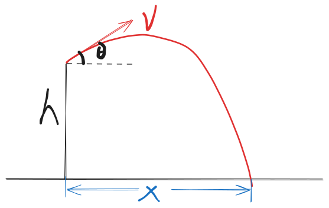
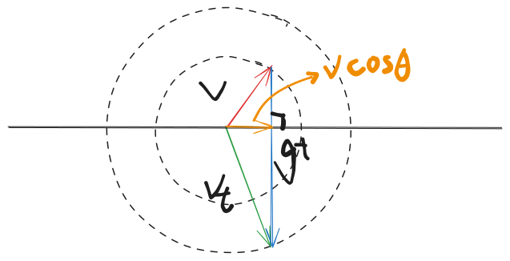

從高度爲 h 的位置，以初速度 v 丟出一球，沿什麼仰角才能讓落點距離 x 最遠？如圖：

## 做法 1

直接爆算。

- 水平方向位移：$x = v\cos\theta\,t$
- 豎直方向位移：$y = v\sin\theta\,t - \frac{1}{2}gt^2 = -h$

隨便聯立一下，把 t 給消掉：

$$
-h = v\sin\theta\,\frac{x}{v\cos\theta} - \frac{1}{2}g\left(\frac{x}{v\cos\theta}\right)^2
$$

整理得：

$$
-h = x\tan\theta - \frac{gx^2}{2v^2}\frac{1}{\cos^2\theta}
$$

由 $\frac{1}{\cos^2\theta} = \frac{\sin^2\theta+\cos^2\theta}{\cos^2\theta} =
\tan^2\theta+1$，得到三角函數僅有 $\tan\theta$ 的式子：

$$
-h = x\tan\theta - \frac{gx^2}{2v^2}(\tan^2\theta+1)
$$

欲求 x 最大值，考慮關於 $\tan\theta$ 二次方程之 $\Delta$：

$$
\begin{aligned}
\Delta &= x^2 - 4\left(-\frac{gx^2}{2v^2}\right)\left(-\frac{gx^2}{2v^2}+h\right) \\
       &= -\frac{g^2}{v^4}x^4 + \left(\frac{2gh}{v^2}+1\right)x^2 \ge 0\\
\end{aligned}
$$

解得：

$$
x^2 \le \frac{2ghv^2+v^4}{g^2}
$$

即：

$$
|x| \le \frac{v}{g}\sqrt{2gh+v^2}
$$

計算太難。

## 做法 2

注意到無論向什麼方向發射，最後落至地面時，速度的大小是一樣的，因爲機械能守恆。

可求出最後的速度 vt：

$$
\begin{aligned}
\frac{1}{2}mv^2+mgh &= \frac{1}{2}mv_{t}^2 \\
v_{t} &= \sqrt{v^2+2gh}
\end{aligned}
$$

考察這個 vt 和 v 以及 v-vt 構成的矢量三角形：

注意到要求的 $x = v\cos\theta\,t$。倘若爲其乘上一個 $g$，即 $v\cos\theta\,gt$，
恰好爲此矢量三角形之面積兩倍，所以求此面積最值，即可得答案。

必刷題上是設 vt 與 v 夾角爲 α，正弦定理有：

$$
\begin{aligned}
\frac{gt}{\sin\alpha} &= \frac{v_{t}}{\sin(\pi/2-\theta)} \\
gt\cos\theta &= v_{t}\sin\alpha
\end{aligned}
$$

所以：

$$
\begin{aligned}
x &= \frac{v\cos\theta\,gt}{g} \\
  &= \frac{v v_{t} \sin\alpha}{g} \\
  &\le \frac{v v_{t}}{g}
\end{aligned}
$$

妙哉！
