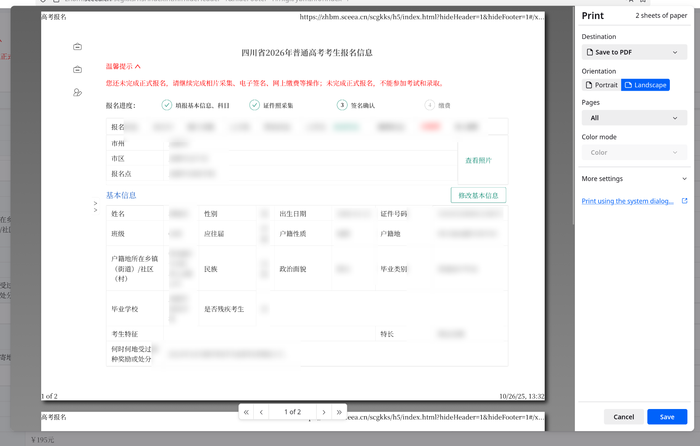

首先登錄高考報名網站：https://zhbm.sceea.cn。

學校要求截圖打印高考報名填寫信息，但是網頁做的很💩，截圖比較麻煩。

簡單分析可以發現其 url 形如：

```
https://zhbm.sceea.cn/#/redirect/iframeMethod?url=https://zhbm.sceea.cn/scgkks/h5/index.html?hideHeader=1&hideFooter=1#/sso
```

明顯是網頁上下加了一個 nav 和 footer，中間夾一個實際內容的 iframe，我們只需要截 iframe 其實就夠了。顯然 `iframeMethod?url=` 後面的就是 `iframe` 實際內容。至於後面的 `#/sso`，這顯然是用某種 spa router 的時候更新頁面沒有更新 location，不要管他就行了。

具體進入：

```
https://zhbm.sceea.cn/scgkks/h5/index.html?hideHeader=1&hideFooter=1#/xgk/ybmInfo?index=1
```

就是所需的高考信息頁。左邊的 navigation drawer 可以收掉。然後 `C-p` 可以打印成 pdf，注意調整紙張大小以及方向，效果大概如圖：



但是這個 print 效果確實有點差。有人可能希望截圖。

大部分瀏覽器都有直接截全頁的功能，很貼心。但直接截圖的產物和電腦分辨率有關，往往不適合打印，如何產生高分辨率的截圖呢？

以 Firefox 爲例，Chormium 的應該差不多。首先 F12，有一個 Responsive Design Mode，對的就是那個模擬手機屏幕的功能。

添加一個自定義設備：寬度 1920 夠了，高度根據自己需要截取的內容大小調，關鍵的是這個 Device Pixel Ratio(DPR)，指的是瀏覽器會用幾個真實像素來渲染一個邏輯像素。比如 DPR=4，則瀏覽器會用 4x4 個像素來渲染一個像素，這樣得到的圖像更加精細。比如我設置 DPR=4，這樣可以得到 7680x4320 的超高清截屏。

最後選用這個自定義設備，然後截圖。

但這個截圖就不要用 Firefox 右鍵那個了。用頂欄（地址欄下方的欄）右側有一個 `Take a screenshot of the viewport`。它雖然不能截全圖，但是我們可以改設備的高度。比如高考報名頁面 1200px 高度差不多能裝下所有內容。

對於 Chromium，用 DevTools 裏頭的截圖，Ctrl-Shift+P 後有個 Capture full size screenshot。

最後能得到放大放大再放大連個羽毛都看的清清楚楚的高清大圖。👍
