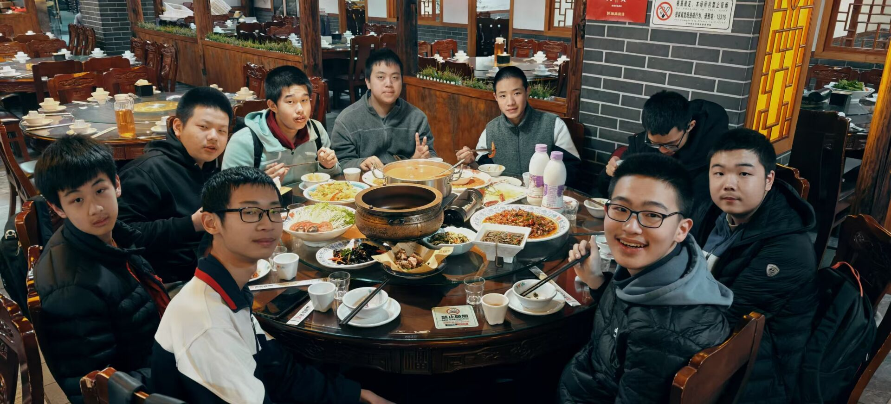

2024 年末，我在重慶，在八中集訓。

下午八中就放學了。熱情的廣東學校教練帶着我們去八中旁邊的徐鼎盛喫飯。

廣東的孩子，平日飲食和川渝這邊風格大不一樣，沒喫幾道菜就辣的不行。我雖是四川的，平日裏喫辣也不太行，喫的面紅耳赤，嘴皮子發燙。

孤僻的信競選手不善於人際交往，這一桌裏頭，竟沒一個能認識一下。這就是 00 後的飯局吧：不必要談點什麼，敬杯酒；只需糊里糊塗喫點什麼，看看手機，就過去了。

大家一起回到酒店，電梯裝不下這麼多人，走幽黑的樓梯上樓。閒人幹點什麼，玩玩遊戲，跨個年。

我打開 B 站直播——這還是我第一次認真看 B 站的跨年晚會。

元旦前一段時間，八中還有午飯晚飯時間在食堂前的表演活動。現場就能報名獻唱，高一到高三，甚至有老師都有參加的。真是——八中學生多才多藝。一頓飯的時間，就能聽到三四首周杰倫的歌。音樂聲音飄揚，晚飯後在機房都能聽到，機房大家常常指指點點，但都沒有人真的去唱的。

我理解不了那些勇敢唱歌的人，像八中的中飯晚飯唱歌的人，NOI 及 WC 文藝演出表演的人。或許人內心深處還是希望表現自己的，可惜既沒有歌喉，更沒有勇氣。

下樓去超市買兩包薯片，兩瓶可樂。是夜晚十一點左右。酒店旁的便利店還二十四小時營着業。深夜的重慶，寒風徐徐吹過，街上少有行人。匆匆回到酒店，不知心中是冷還是暖。

葉總愛玩殺戮尖塔，我玩玩 Hypixel，看看 B 站晚會。然後就跨年了。

莫名想起哭泣少女樂隊。仁菜隻身一人來到川崎。有點夢想，更有現實逼迫無奈。寄居他鄉、孤立無援。她站在漆黑的房屋中央，手裏拿着新的電燈泡，伸出手，卻搆不着。

重慶的集訓強度很大。我頭一次感覺，原來停掉文化課集訓競賽，應該這麼訓。先前在成外，確實太悠閒了。

後來去了冬令營，後來又在八中訓了一段時間，後來省選掛了。

2025 末，我就在成外。

回歸文化課居然已有九個月。開始時覺得天塌了，後來也覺得沒什麼，很長一段時間沒有寫過代碼了。文化課成績大概還可以，但遠比不上班上如 ckq 之類人，他競賽回來不久就能年級第 9，太可怕了。

下午我騎着自行車，去綠道騎了一下午。好久沒有這樣騎了。冬天，風颳得很冷，下巴吹的麻，還有流鼻涕。

騎到哪裏是次要的。上坡、下坡、上坡、下坡。只管前進。

有時停下來，看看橋下小河，道旁湖泊。人還是應該多親近大自然。

綠道旁是一個紡織專科學校。這裏的學生其實也就比我大幾歲吧。

晚上不知道幹什麼，就是無所事事，也沒看什麼節目。能聽到煙花聲音，也算是跨年儀式了。

明年的我會在哪裏？
