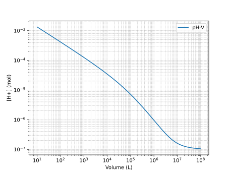

很久以前就寫好了，但是由於 Astro 不好配置 mhchem 一直沒發，沒想到更新到 Astro 5 然後突然就能用了🤯。

---

有了 $K_{a}$，$K_{w}$，以及兩個守恆之後，可以解出所有东西。假設某一元弱酸 $\ce{HA}$，其電離常數爲 $K_{a}$，水的電離常數爲 $K_{w}$，總共有 $\pu{n mol}$，體積爲 $\pu{V L}$。可以列出以下式子：

$$
\begin{cases}
\ce{[H+]} \ce{[OH-]} = K_{w} \\
\dfrac{\ce{[H+]} \ce{[A-]}}{\ce{[HA]}} = K_{a} \\
\ce{[HA]} + \ce{[A-]} = \frac{n}{V} \\
\ce{[H+]} = \ce{[OH-]} + \ce{[A-]}
\end{cases}
$$

總共有 4 個方程，同時也恰好有 4 個未知量，所以每個未知量都**可解**。

消元整理得到：

$$
\ce{[H+]}^{3} + K_{a} \ce{[H+]}^{2} - \left(K_{w} + \frac{K_{a} n}{V}\right)\ce{[H+]} - K_{a} K_{w} = 0
$$

簡單的一元弱酸，$\ce{[H+]}$ 與 $V$ 的關係居然是一個三次方程，並且沒法因式分解。對於 $n$ 元酸，則是 $n+2$ 次方程。

這個方程一共有三個實根，兩負一正。求解三次方程可以用 NumPy 的 roots 函數，使用方法如 `np.polynomial.Polynomial([1, 1, 4]).roots()`。也可以用 SymPy，但是 SymPy 是直接套的三次方程求根公式，求數值的時候會有精度問題。lambdify 後可能出現 `invalid value encountered in sqrt`，一個粗暴的解決方法是讓 lambdify 使用 mpmath 計算（傳入參數 `modules=["mpmath"]`）。

最終圖像（帶的是醋酸 $K_a=1.8 \times 10^-5$，$K_w = 1 \times 10^{-14}$）：



參考代碼：

```python
import sympy as sp
import numpy as np
from mpmath import mp
import matplotlib.pyplot as plt

K_a, K_w, n, V = sp.symbols('K_a, K_w, n, V', positive=True, real=True)
H, OH, X, HX = sp.symbols('[H^{+}], [OH^{-}], [X^{-}], [HX]', positive=True, real=True)

root = sp.solve(H**3 + K_a * H**2 - (K_a * n / V + K_w) * H - K_a * K_w, H)

root_lambda = sp.lambdify(V, root[2].subs(((K_a, sp.Rational("1.8e-5")), (K_w, sp.Rational("1e-14")), (n, sp.Rational("1")))), modules=["mpmath"])
mp.dps=100

V_values = np.logspace(1, 8, 1000)
H_values = []

for i in V_values:
    res = root_lambda(i)
    H_values.append(res.real)

plt.plot(V_values, H_values, label='pH-V')
plt.xlabel("Volume (L)")
plt.ylabel("[H+] (mol)")
plt.yscale("log")
plt.xscale("log")
plt.grid(True, which="both", linestyle="--", linewidth=0.5)
plt.legend()
plt.show()
```
